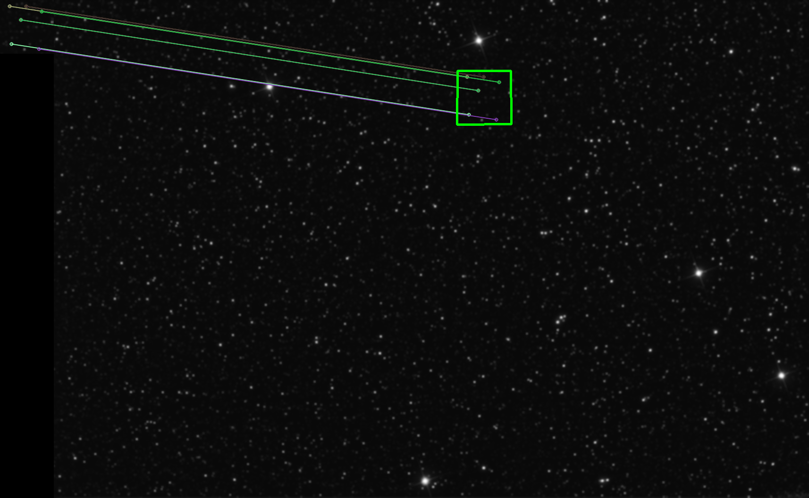

# Object Detection with Feature Matching



---

## Dependencies for Running Locally

* Python 3.7.5 
* OpenCV 4.4.0 
* Numpy
  
---

## Project Files
* solution.py #executable python file or call the function
* solution.ipynb #analys the problem step by step
* StarMap.png
* Small_area.png
* Small_area_rotated.png

---

## How to run?

* You could direclty with this script:
 
> python solution.py

<br/>
Or
<br/>

* Use via import
 
 ```python
    from solution import Solution

    solution = Solution()
    points = solution.localize_object(img1, img2)
```


> Output: [(855, 150), (968, 150), (969, 263), (854, 264)]


<br/><br/>

# Steps:

## 1. Read Image Files 
Using Opencv "imread()" function. You could read the image data in Gray Scale directly.(normally OpenCV reads in BGR format.)
In the Gray Scale format, We are working on one channel data.

 ```python
    img1 = cv.imread('Small_area.png', cv.IMREAD_GRAYSCALE)
    img2 = cv.imread('StarMap.png', cv.IMREAD_GRAYSCALE)
```

## 2. Apply Gaussian Blur
For blurring the image and to reduce the noise of the images

```python
    img1 = cv.GaussianBlur(img1,(5,5),cv.BORDER_DEFAULT)
    img2 = cv.GaussianBlur(img2,(5,5),cv.BORDER_DEFAULT)
```

## 3. Create a SIFT Keypoint Detector

```python
    sift = cv.SIFT_create(50000)
```

## 4. Find the Keypoints & Descriptors SIFT

```python
    kp1, des1 = sift.detectAndCompute(img1,None)
    kp2, des2 = sift.detectAndCompute(img2,None)
```

## 5. Feature points matching reduction
```python
    matcher = cv.DescriptorMatcher_create(cv.DescriptorMatcher_FLANNBASED)
    knn_matches = matcher.knnMatch(des1, des2, 2)
    #-- Filter matches using the Lowe's ratio test
    ratio_thresh = 0.8
    good_matches = []
    for m,n in knn_matches:
        if m.distance < ratio_thresh * n.distance:
            good_matches.append(m)
```

## 6. Localize the object & Find the Homography Object Relates the transformation between two planes

<div class="MathJax_Display" style="text-align: center;"><span class="MathJax" id="MathJax-Element-1-Frame" tabindex="0" style="text-align: center;"><nobr><span class="math" id="MathJax-Span-1" style="width: 25.436em; display: inline-block;"><span style="display: inline-block; position: relative; width: 19.264em; height: 0px; font-size: 132%;"><span style="position: absolute; clip: rect(1.157em, 1018.94em, 5.486em, -1000em); top: -3.571em; left: 0em;"><span class="mrow" id="MathJax-Span-2"><span class="mi" id="MathJax-Span-3" style="font-family: MathJax_Math; font-style: italic;">s</span><span class="mrow" id="MathJax-Span-4" style="padding-left: 0.167em;"><span class="mo" id="MathJax-Span-5" style="vertical-align: 2.252em;"><span style="display: inline-block; position: relative; width: 0.667em; height: 0px;"><span style="position: absolute; font-family: MathJax_Size4; top: -2.85em; left: 0em;">⎡<span style="display: inline-block; width: 0px; height: 4.004em;"></span></span><span style="position: absolute; font-family: MathJax_Size4; top: -0.644em; left: 0em;">⎣<span style="display: inline-block; width: 0px; height: 4.004em;"></span></span><span style="font-family: MathJax_Size4; position: absolute; top: -1.701em; left: 0em;">⎢<span style="display: inline-block; width: 0px; height: 4.004em;"></span></span></span></span><span class="mtable" id="MathJax-Span-6" style="padding-right: 0.167em; padding-left: 0.167em;"><span style="display: inline-block; position: relative; width: 0.838em; height: 0px;"><span style="position: absolute; clip: rect(2.402em, 1000.84em, 6.53em, -1000em); top: -4.816em; left: 0em;"><span style="display: inline-block; position: relative; width: 0.838em; height: 0px;"><span style="position: absolute; clip: rect(2.942em, 1000.84em, 4.178em, -1000em); top: -5.357em; left: 50%; margin-left: -0.419em;"><span class="mtd" id="MathJax-Span-7"><span class="mrow" id="MathJax-Span-8"><span class="msubsup" id="MathJax-Span-9"><span style="display: inline-block; position: relative; width: 0.838em; height: 0px;"><span style="position: absolute; clip: rect(3.4em, 1000.52em, 4.178em, -1000em); top: -4.004em; left: 0em;"><span class="mi" id="MathJax-Span-10" style="font-family: MathJax_Math; font-style: italic;">x</span><span style="display: inline-block; width: 0px; height: 4.004em;"></span></span><span style="position: absolute; top: -4.367em; left: 0.572em;"><span class="texatom" id="MathJax-Span-11"><span class="mrow" id="MathJax-Span-12"><span class="msup" id="MathJax-Span-13"><span style="display: inline-block; position: relative; width: 0.191em; height: 0px;"><span style="position: absolute; clip: rect(3.842em, 1000em, 4.167em, -1000em); top: -4.004em; left: 0em;"><span class="mi" id="MathJax-Span-14" style="font-size: 70.7%;"></span><span style="display: inline-block; width: 0px; height: 4.004em;"></span></span><span style="position: absolute; top: -4.261em; left: 0em;"><span class="mo" id="MathJax-Span-15" style="font-size: 50%; font-family: MathJax_Main;">′</span><span style="display: inline-block; width: 0px; height: 4.004em;"></span></span></span></span></span></span><span style="display: inline-block; width: 0px; height: 4.004em;"></span></span></span></span></span></span><span style="display: inline-block; width: 0px; height: 4.004em;"></span></span><span style="position: absolute; clip: rect(2.942em, 1000.81em, 4.372em, -1000em); top: -3.857em; left: 50%; margin-left: -0.407em;"><span class="mtd" id="MathJax-Span-16"><span class="mrow" id="MathJax-Span-17"><span class="msubsup" id="MathJax-Span-18"><span style="display: inline-block; position: relative; width: 0.813em; height: 0px;"><span style="position: absolute; clip: rect(3.4em, 1000.5em, 4.372em, -1000em); top: -4.004em; left: 0em;"><span class="mi" id="MathJax-Span-19" style="font-family: MathJax_Math; font-style: italic;">y<span style="display: inline-block; overflow: hidden; height: 1px; width: 0.006em;"></span></span><span style="display: inline-block; width: 0px; height: 4.004em;"></span></span><span style="position: absolute; top: -4.367em; left: 0.548em;"><span class="texatom" id="MathJax-Span-20"><span class="mrow" id="MathJax-Span-21"><span class="msup" id="MathJax-Span-22"><span style="display: inline-block; position: relative; width: 0.191em; height: 0px;"><span style="position: absolute; clip: rect(3.842em, 1000em, 4.167em, -1000em); top: -4.004em; left: 0em;"><span class="mi" id="MathJax-Span-23" style="font-size: 70.7%;"></span><span style="display: inline-block; width: 0px; height: 4.004em;"></span></span><span style="position: absolute; top: -4.261em; left: 0em;"><span class="mo" id="MathJax-Span-24" style="font-size: 50%; font-family: MathJax_Main;">′</span><span style="display: inline-block; width: 0px; height: 4.004em;"></span></span></span></span></span></span><span style="display: inline-block; width: 0px; height: 4.004em;"></span></span></span></span></span></span><span style="display: inline-block; width: 0px; height: 4.004em;"></span></span><span style="position: absolute; clip: rect(3.176em, 1000.43em, 4.167em, -1000em); top: -2.452em; left: 50%; margin-left: -0.25em;"><span class="mtd" id="MathJax-Span-25"><span class="mrow" id="MathJax-Span-26"><span class="mn" id="MathJax-Span-27" style="font-family: MathJax_Main;">1</span></span></span><span style="display: inline-block; width: 0px; height: 4.004em;"></span></span></span><span style="display: inline-block; width: 0px; height: 4.816em;"></span></span></span></span><span class="mo" id="MathJax-Span-28" style="vertical-align: 2.252em;"><span style="display: inline-block; position: relative; width: 0.667em; height: 0px;"><span style="position: absolute; font-family: MathJax_Size4; top: -2.85em; left: 0em;">⎤<span style="display: inline-block; width: 0px; height: 4.004em;"></span></span><span style="position: absolute; font-family: MathJax_Size4; top: -0.644em; left: 0em;">⎦<span style="display: inline-block; width: 0px; height: 4.004em;"></span></span><span style="font-family: MathJax_Size4; position: absolute; top: -1.701em; left: 0em;">⎥<span style="display: inline-block; width: 0px; height: 4.004em;"></span></span></span></span></span><span class="mo" id="MathJax-Span-29" style="font-family: MathJax_Main; padding-left: 0.278em;">=</span><span class="mi" id="MathJax-Span-30" style="font-family: MathJax_Math; font-style: italic; padding-left: 0.278em;">H<span style="display: inline-block; overflow: hidden; height: 1px; width: 0.057em;"></span></span><span class="mrow" id="MathJax-Span-31" style="padding-left: 0.167em;"><span class="mo" id="MathJax-Span-32" style="vertical-align: 2.152em;"><span style="display: inline-block; position: relative; width: 0.667em; height: 0px;"><span style="position: absolute; font-family: MathJax_Size4; top: -2.85em; left: 0em;">⎡<span style="display: inline-block; width: 0px; height: 4.004em;"></span></span><span style="position: absolute; font-family: MathJax_Size4; top: -0.843em; left: 0em;">⎣<span style="display: inline-block; width: 0px; height: 4.004em;"></span></span><span style="font-family: MathJax_Size4; position: absolute; top: -1.801em; left: 0em;">⎢<span style="display: inline-block; width: 0px; height: 4.004em;"></span></span></span></span><span class="mtable" id="MathJax-Span-33" style="padding-right: 0.167em; padding-left: 0.167em;"><span style="display: inline-block; position: relative; width: 0.572em; height: 0px;"><span style="position: absolute; clip: rect(2.264em, 1000.52em, 5.836em, -1000em); top: -4.221em; left: 0em;"><span style="display: inline-block; position: relative; width: 0.572em; height: 0px;"><span style="position: absolute; clip: rect(3.4em, 1000.52em, 4.178em, -1000em); top: -5.357em; left: 50%; margin-left: -0.286em;"><span class="mtd" id="MathJax-Span-34"><span class="mrow" id="MathJax-Span-35"><span class="mi" id="MathJax-Span-36" style="font-family: MathJax_Math; font-style: italic;">x</span></span></span><span style="display: inline-block; width: 0px; height: 4.004em;"></span></span><span style="position: absolute; clip: rect(3.4em, 1000.5em, 4.372em, -1000em); top: -3.957em; left: 50%; margin-left: -0.248em;"><span class="mtd" id="MathJax-Span-37"><span class="mrow" id="MathJax-Span-38"><span class="mi" id="MathJax-Span-39" style="font-family: MathJax_Math; font-style: italic;">y<span style="display: inline-block; overflow: hidden; height: 1px; width: 0.006em;"></span></span></span></span><span style="display: inline-block; width: 0px; height: 4.004em;"></span></span><span style="position: absolute; clip: rect(3.176em, 1000.43em, 4.167em, -1000em); top: -2.552em; left: 50%; margin-left: -0.25em;"><span class="mtd" id="MathJax-Span-40"><span class="mrow" id="MathJax-Span-41"><span class="mn" id="MathJax-Span-42" style="font-family: MathJax_Main;">1</span></span></span><span style="display: inline-block; width: 0px; height: 4.004em;"></span></span></span><span style="display: inline-block; width: 0px; height: 4.221em;"></span></span></span></span><span class="mo" id="MathJax-Span-43" style="vertical-align: 2.152em;"><span style="display: inline-block; position: relative; width: 0.667em; height: 0px;"><span style="position: absolute; font-family: MathJax_Size4; top: -2.85em; left: 0em;">⎤<span style="display: inline-block; width: 0px; height: 4.004em;"></span></span><span style="position: absolute; font-family: MathJax_Size4; top: -0.843em; left: 0em;">⎦<span style="display: inline-block; width: 0px; height: 4.004em;"></span></span><span style="font-family: MathJax_Size4; position: absolute; top: -1.801em; left: 0em;">⎥<span style="display: inline-block; width: 0px; height: 4.004em;"></span></span></span></span></span><span class="mo" id="MathJax-Span-44" style="font-family: MathJax_Main; padding-left: 0.278em;">=</span><span class="mrow" id="MathJax-Span-45" style="padding-left: 0.278em;"><span class="mo" id="MathJax-Span-46" style="vertical-align: 2.15em;"><span style="display: inline-block; position: relative; width: 0.667em; height: 0px;"><span style="position: absolute; font-family: MathJax_Size4; top: -2.85em; left: 0em;">⎡<span style="display: inline-block; width: 0px; height: 4.004em;"></span></span><span style="position: absolute; font-family: MathJax_Size4; top: -0.848em; left: 0em;">⎣<span style="display: inline-block; width: 0px; height: 4.004em;"></span></span><span style="font-family: MathJax_Size4; position: absolute; top: -1.803em; left: 0em;">⎢<span style="display: inline-block; width: 0px; height: 4.004em;"></span></span></span></span><span class="mtable" id="MathJax-Span-47" style="padding-right: 0.167em; padding-left: 0.167em;"><span style="display: inline-block; position: relative; width: 6.074em; height: 0px;"><span style="position: absolute; clip: rect(2.447em, 1001.36em, 6.432em, -1000em); top: -4.654em; left: 0em;"><span style="display: inline-block; position: relative; width: 1.358em; height: 0px;"><span style="position: absolute; clip: rect(3.148em, 1001.36em, 4.317em, -1000em); top: -5.354em; left: 50%; margin-left: -0.679em;"><span class="mtd" id="MathJax-Span-48"><span class="mrow" id="MathJax-Span-49"><span class="msubsup" id="MathJax-Span-50"><span style="display: inline-block; position: relative; width: 1.358em; height: 0px;"><span style="position: absolute; clip: rect(3.148em, 1000.56em, 4.178em, -1000em); top: -4.004em; left: 0em;"><span class="mi" id="MathJax-Span-51" style="font-family: MathJax_Math; font-style: italic;">h</span><span style="display: inline-block; width: 0px; height: 4.004em;"></span></span><span style="position: absolute; top: -3.854em; left: 0.576em;"><span class="texatom" id="MathJax-Span-52"><span class="mrow" id="MathJax-Span-53"><span class="mn" id="MathJax-Span-54" style="font-size: 70.7%; font-family: MathJax_Main;">11</span></span></span><span style="display: inline-block; width: 0px; height: 4.004em;"></span></span></span></span></span></span><span style="display: inline-block; width: 0px; height: 4.004em;"></span></span><span style="position: absolute; clip: rect(3.148em, 1001.36em, 4.317em, -1000em); top: -3.954em; left: 50%; margin-left: -0.679em;"><span class="mtd" id="MathJax-Span-69"><span class="mrow" id="MathJax-Span-70"><span class="msubsup" id="MathJax-Span-71"><span style="display: inline-block; position: relative; width: 1.358em; height: 0px;"><span style="position: absolute; clip: rect(3.148em, 1000.56em, 4.178em, -1000em); top: -4.004em; left: 0em;"><span class="mi" id="MathJax-Span-72" style="font-family: MathJax_Math; font-style: italic;">h</span><span style="display: inline-block; width: 0px; height: 4.004em;"></span></span><span style="position: absolute; top: -3.854em; left: 0.576em;"><span class="texatom" id="MathJax-Span-73"><span class="mrow" id="MathJax-Span-74"><span class="mn" id="MathJax-Span-75" style="font-size: 70.7%; font-family: MathJax_Main;">21</span></span></span><span style="display: inline-block; width: 0px; height: 4.004em;"></span></span></span></span></span></span><span style="display: inline-block; width: 0px; height: 4.004em;"></span></span><span style="position: absolute; clip: rect(3.148em, 1001.36em, 4.332em, -1000em); top: -2.554em; left: 50%; margin-left: -0.679em;"><span class="mtd" id="MathJax-Span-90"><span class="mrow" id="MathJax-Span-91"><span class="msubsup" id="MathJax-Span-92"><span style="display: inline-block; position: relative; width: 1.358em; height: 0px;"><span style="position: absolute; clip: rect(3.148em, 1000.56em, 4.178em, -1000em); top: -4.004em; left: 0em;"><span class="mi" id="MathJax-Span-93" style="font-family: MathJax_Math; font-style: italic;">h</span><span style="display: inline-block; width: 0px; height: 4.004em;"></span></span><span style="position: absolute; top: -3.854em; left: 0.576em;"><span class="texatom" id="MathJax-Span-94"><span class="mrow" id="MathJax-Span-95"><span class="mn" id="MathJax-Span-96" style="font-size: 70.7%; font-family: MathJax_Main;">31</span></span></span><span style="display: inline-block; width: 0px; height: 4.004em;"></span></span></span></span></span></span><span style="display: inline-block; width: 0px; height: 4.004em;"></span></span></span><span style="display: inline-block; width: 0px; height: 4.654em;"></span></span><span style="position: absolute; clip: rect(2.447em, 1001.36em, 6.432em, -1000em); top: -4.654em; left: 2.358em;"><span style="display: inline-block; position: relative; width: 1.358em; height: 0px;"><span style="position: absolute; clip: rect(3.148em, 1001.36em, 4.317em, -1000em); top: -5.354em; left: 50%; margin-left: -0.679em;"><span class="mtd" id="MathJax-Span-55"><span class="mrow" id="MathJax-Span-56"><span class="msubsup" id="MathJax-Span-57"><span style="display: inline-block; position: relative; width: 1.358em; height: 0px;"><span style="position: absolute; clip: rect(3.148em, 1000.56em, 4.178em, -1000em); top: -4.004em; left: 0em;"><span class="mi" id="MathJax-Span-58" style="font-family: MathJax_Math; font-style: italic;">h</span><span style="display: inline-block; width: 0px; height: 4.004em;"></span></span><span style="position: absolute; top: -3.854em; left: 0.576em;"><span class="texatom" id="MathJax-Span-59"><span class="mrow" id="MathJax-Span-60"><span class="mn" id="MathJax-Span-61" style="font-size: 70.7%; font-family: MathJax_Main;">12</span></span></span><span style="display: inline-block; width: 0px; height: 4.004em;"></span></span></span></span></span></span><span style="display: inline-block; width: 0px; height: 4.004em;"></span></span><span style="position: absolute; clip: rect(3.148em, 1001.36em, 4.317em, -1000em); top: -3.954em; left: 50%; margin-left: -0.679em;"><span class="mtd" id="MathJax-Span-76"><span class="mrow" id="MathJax-Span-77"><span class="msubsup" id="MathJax-Span-78"><span style="display: inline-block; position: relative; width: 1.358em; height: 0px;"><span style="position: absolute; clip: rect(3.148em, 1000.56em, 4.178em, -1000em); top: -4.004em; left: 0em;"><span class="mi" id="MathJax-Span-79" style="font-family: MathJax_Math; font-style: italic;">h</span><span style="display: inline-block; width: 0px; height: 4.004em;"></span></span><span style="position: absolute; top: -3.854em; left: 0.576em;"><span class="texatom" id="MathJax-Span-80"><span class="mrow" id="MathJax-Span-81"><span class="mn" id="MathJax-Span-82" style="font-size: 70.7%; font-family: MathJax_Main;">22</span></span></span><span style="display: inline-block; width: 0px; height: 4.004em;"></span></span></span></span></span></span><span style="display: inline-block; width: 0px; height: 4.004em;"></span></span><span style="position: absolute; clip: rect(3.148em, 1001.36em, 4.332em, -1000em); top: -2.554em; left: 50%; margin-left: -0.679em;"><span class="mtd" id="MathJax-Span-97"><span class="mrow" id="MathJax-Span-98"><span class="msubsup" id="MathJax-Span-99"><span style="display: inline-block; position: relative; width: 1.358em; height: 0px;"><span style="position: absolute; clip: rect(3.148em, 1000.56em, 4.178em, -1000em); top: -4.004em; left: 0em;"><span class="mi" id="MathJax-Span-100" style="font-family: MathJax_Math; font-style: italic;">h</span><span style="display: inline-block; width: 0px; height: 4.004em;"></span></span><span style="position: absolute; top: -3.854em; left: 0.576em;"><span class="texatom" id="MathJax-Span-101"><span class="mrow" id="MathJax-Span-102"><span class="mn" id="MathJax-Span-103" style="font-size: 70.7%; font-family: MathJax_Main;">32</span></span></span><span style="display: inline-block; width: 0px; height: 4.004em;"></span></span></span></span></span></span><span style="display: inline-block; width: 0px; height: 4.004em;"></span></span></span><span style="display: inline-block; width: 0px; height: 4.654em;"></span></span><span style="position: absolute; clip: rect(2.447em, 1001.36em, 6.432em, -1000em); top: -4.654em; left: 4.716em;"><span style="display: inline-block; position: relative; width: 1.358em; height: 0px;"><span style="position: absolute; clip: rect(3.148em, 1001.36em, 4.332em, -1000em); top: -5.354em; left: 50%; margin-left: -0.679em;"><span class="mtd" id="MathJax-Span-62"><span class="mrow" id="MathJax-Span-63"><span class="msubsup" id="MathJax-Span-64"><span style="display: inline-block; position: relative; width: 1.358em; height: 0px;"><span style="position: absolute; clip: rect(3.148em, 1000.56em, 4.178em, -1000em); top: -4.004em; left: 0em;"><span class="mi" id="MathJax-Span-65" style="font-family: MathJax_Math; font-style: italic;">h</span><span style="display: inline-block; width: 0px; height: 4.004em;"></span></span><span style="position: absolute; top: -3.854em; left: 0.576em;"><span class="texatom" id="MathJax-Span-66"><span class="mrow" id="MathJax-Span-67"><span class="mn" id="MathJax-Span-68" style="font-size: 70.7%; font-family: MathJax_Main;">13</span></span></span><span style="display: inline-block; width: 0px; height: 4.004em;"></span></span></span></span></span></span><span style="display: inline-block; width: 0px; height: 4.004em;"></span></span><span style="position: absolute; clip: rect(3.148em, 1001.36em, 4.332em, -1000em); top: -3.954em; left: 50%; margin-left: -0.679em;"><span class="mtd" id="MathJax-Span-83"><span class="mrow" id="MathJax-Span-84"><span class="msubsup" id="MathJax-Span-85"><span style="display: inline-block; position: relative; width: 1.358em; height: 0px;"><span style="position: absolute; clip: rect(3.148em, 1000.56em, 4.178em, -1000em); top: -4.004em; left: 0em;"><span class="mi" id="MathJax-Span-86" style="font-family: MathJax_Math; font-style: italic;">h</span><span style="display: inline-block; width: 0px; height: 4.004em;"></span></span><span style="position: absolute; top: -3.854em; left: 0.576em;"><span class="texatom" id="MathJax-Span-87"><span class="mrow" id="MathJax-Span-88"><span class="mn" id="MathJax-Span-89" style="font-size: 70.7%; font-family: MathJax_Main;">23</span></span></span><span style="display: inline-block; width: 0px; height: 4.004em;"></span></span></span></span></span></span><span style="display: inline-block; width: 0px; height: 4.004em;"></span></span><span style="position: absolute; clip: rect(3.148em, 1001.36em, 4.332em, -1000em); top: -2.554em; left: 50%; margin-left: -0.679em;"><span class="mtd" id="MathJax-Span-104"><span class="mrow" id="MathJax-Span-105"><span class="msubsup" id="MathJax-Span-106"><span style="display: inline-block; position: relative; width: 1.358em; height: 0px;"><span style="position: absolute; clip: rect(3.148em, 1000.56em, 4.178em, -1000em); top: -4.004em; left: 0em;"><span class="mi" id="MathJax-Span-107" style="font-family: MathJax_Math; font-style: italic;">h</span><span style="display: inline-block; width: 0px; height: 4.004em;"></span></span><span style="position: absolute; top: -3.854em; left: 0.576em;"><span class="texatom" id="MathJax-Span-108"><span class="mrow" id="MathJax-Span-109"><span class="mn" id="MathJax-Span-110" style="font-size: 70.7%; font-family: MathJax_Main;">33</span></span></span><span style="display: inline-block; width: 0px; height: 4.004em;"></span></span></span></span></span></span><span style="display: inline-block; width: 0px; height: 4.004em;"></span></span></span><span style="display: inline-block; width: 0px; height: 4.654em;"></span></span></span></span><span class="mo" id="MathJax-Span-111" style="vertical-align: 2.15em;"><span style="display: inline-block; position: relative; width: 0.667em; height: 0px;"><span style="position: absolute; font-family: MathJax_Size4; top: -2.85em; left: 0em;">⎤<span style="display: inline-block; width: 0px; height: 4.004em;"></span></span><span style="position: absolute; font-family: MathJax_Size4; top: -0.848em; left: 0em;">⎦<span style="display: inline-block; width: 0px; height: 4.004em;"></span></span><span style="font-family: MathJax_Size4; position: absolute; top: -1.803em; left: 0em;">⎥<span style="display: inline-block; width: 0px; height: 4.004em;"></span></span></span></span></span><span class="mrow" id="MathJax-Span-112" style="padding-left: 0.167em;"><span class="mo" id="MathJax-Span-113" style="vertical-align: 2.152em;"><span style="display: inline-block; position: relative; width: 0.667em; height: 0px;"><span style="position: absolute; font-family: MathJax_Size4; top: -2.85em; left: 0em;">⎡<span style="display: inline-block; width: 0px; height: 4.004em;"></span></span><span style="position: absolute; font-family: MathJax_Size4; top: -0.843em; left: 0em;">⎣<span style="display: inline-block; width: 0px; height: 4.004em;"></span></span><span style="font-family: MathJax_Size4; position: absolute; top: -1.801em; left: 0em;">⎢<span style="display: inline-block; width: 0px; height: 4.004em;"></span></span></span></span><span class="mtable" id="MathJax-Span-114" style="padding-right: 0.167em; padding-left: 0.167em;"><span style="display: inline-block; position: relative; width: 0.572em; height: 0px;"><span style="position: absolute; clip: rect(2.264em, 1000.52em, 5.836em, -1000em); top: -4.221em; left: 0em;"><span style="display: inline-block; position: relative; width: 0.572em; height: 0px;"><span style="position: absolute; clip: rect(3.4em, 1000.52em, 4.178em, -1000em); top: -5.357em; left: 50%; margin-left: -0.286em;"><span class="mtd" id="MathJax-Span-115"><span class="mrow" id="MathJax-Span-116"><span class="mi" id="MathJax-Span-117" style="font-family: MathJax_Math; font-style: italic;">x</span></span></span><span style="display: inline-block; width: 0px; height: 4.004em;"></span></span><span style="position: absolute; clip: rect(3.4em, 1000.5em, 4.372em, -1000em); top: -3.957em; left: 50%; margin-left: -0.248em;"><span class="mtd" id="MathJax-Span-118"><span class="mrow" id="MathJax-Span-119"><span class="mi" id="MathJax-Span-120" style="font-family: MathJax_Math; font-style: italic;">y<span style="display: inline-block; overflow: hidden; height: 1px; width: 0.006em;"></span></span></span></span><span style="display: inline-block; width: 0px; height: 4.004em;"></span></span><span style="position: absolute; clip: rect(3.176em, 1000.43em, 4.167em, -1000em); top: -2.552em; left: 50%; margin-left: -0.25em;"><span class="mtd" id="MathJax-Span-121"><span class="mrow" id="MathJax-Span-122"><span class="mn" id="MathJax-Span-123" style="font-family: MathJax_Main;">1</span></span></span><span style="display: inline-block; width: 0px; height: 4.004em;"></span></span></span><span style="display: inline-block; width: 0px; height: 4.221em;"></span></span></span></span><span class="mo" id="MathJax-Span-124" style="vertical-align: 2.152em;"><span style="display: inline-block; position: relative; width: 0.667em; height: 0px;"><span style="position: absolute; font-family: MathJax_Size4; top: -2.85em; left: 0em;">⎤<span style="display: inline-block; width: 0px; height: 4.004em;"></span></span><span style="position: absolute; font-family: MathJax_Size4; top: -0.843em; left: 0em;">⎦<span style="display: inline-block; width: 0px; height: 4.004em;"></span></span><span style="font-family: MathJax_Size4; position: absolute; top: -1.801em; left: 0em;">⎥<span style="display: inline-block; width: 0px; height: 4.004em;"></span></span></span></span></span></span><span style="display: inline-block; width: 0px; height: 3.571em;"></span></span></span><span style="display: inline-block; overflow: hidden; vertical-align: -2.384em; border-left: 0px solid; width: 0px; height: 5.428em;"></span></span></nobr></span></div>


```python
obj = np.empty((len(good_matches),2), dtype=np.float32)
scene = np.empty((len(good_matches),2), dtype=np.float32)
for i in range(len(good_matches)):
    #-- Get the keypoints from the good matches
    obj[i,0] = kp1[good_matches[i].queryIdx].pt[0]
    obj[i,1] = kp1[good_matches[i].queryIdx].pt[1]
    scene[i,0] = kp2[good_matches[i].trainIdx].pt[0]
    scene[i,1] = kp2[good_matches[i].trainIdx].pt[1]
H, _ =  cv.findHomography(obj, scene, cv.RANSAC)
```

**Note:** RANSAC is the basic and useful algorithm for the detection of the plane in supervised learning


## 7. Result: localize the object in the scene image

 **result_points** return 4 points in the scene image so You could draw lines

```python
    obj_corners = np.empty((4,1,2), dtype=np.float32)
    obj_corners[0,0,0] = 0
    obj_corners[0,0,1] = 0
    obj_corners[1,0,0] = img1.shape[1]
    obj_corners[1,0,1] = 0
    obj_corners[2,0,0] = img1.shape[1]
    obj_corners[2,0,1] = img1.shape[0]
    obj_corners[3,0,0] = 0
    obj_corners[3,0,1] = img1.shape[0]
    scene_corners = cv.perspectiveTransform(obj_corners, H)

    result_points = [
        (int(scene_corners[0,0,0] + img1.shape[1]), int(scene_corners[0,0,1])),
        (int(scene_corners[1,0,0] + img1.shape[1]), int(scene_corners[1,0,1])),
        (int(scene_corners[3,0,0] + img1.shape[1]), int(scene_corners[3,0,1])),
        (int(scene_corners[0,0,0] + img1.shape[1]), int(scene_corners[0,0,1]))
    ]
```


---

<br/><br/>
# Other Solution & Potential Improvments:
* Maybe for simple solution template matching is useful rotating with different angels ( cv.matchTemplate() ) 
  
* I use Sift Detector in this solution may be other detectors are more accurate with different parameters.

* Parameters could be set automatically, not static values.

* This is a static solution for designing two parts from a scene image and a cropped scene image. It's not a generic solution. Perhaps it is useful to create a CNN, collect lots of images from the sky and labeling their location. (Like YOLO and SSD)


---

<br/><br/>
# References
[1] https://www.researchgate.net/publication/328991586_Image_Feature_Matching_and_Object_Detection_Using_Brute-Force_Matchers

[2] https://docs.opencv.org/3.4/dc/dc3/tutorial_py_matcher.html

[3] https://www.mathworks.com/help/vision/ug/object-detection-in-a-cluttered-scene-using-point-feature-matching.html#d122e4325